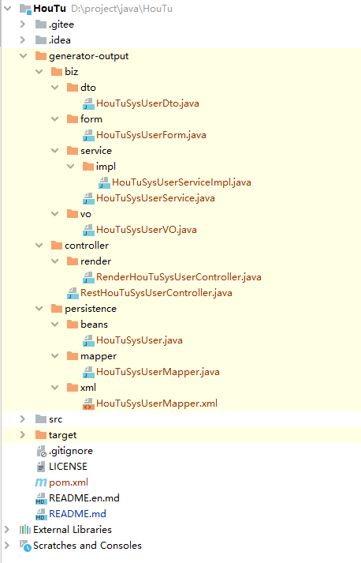

<p align="center">
	<h1>HouTu</h1>
</p>
<p align="center">
	<strong>HouTu，一款基于MySQL的简单易用又功能强大的代码生成工具。取名后土，后土又名後土，源于母系社会自然崇拜中的土地与女性崇拜。其掌阴阳，育万物，因此被称为大地之母。本项目取名HouTu，取义“育万物”之意，通过定制Freemarker模板，可以生成任意结构化的代码，如 DO、Mapper、XML、Service、Controller、SQL、Html等等，只要你能写出模板，HouTu就能交付给你成品代码。</strong>
</p>
<p align="center">
	<a target="_blank" href="https://gitee.com/yadong.zhang/HouTu/blob/master/LICENSE">
		</img>
	</a>
	<a target="_blank" href="https://www.oracle.com/technetwork/java/javase/downloads/index.html">
		</img>
	</a>
	<a target="_blank" href="https://apidoc.gitee.com/yadong.zhang/HouTu/" title="API文档">
		</img>
	</a>
	<a href='https://gitee.com/yadong.zhang/HouTu/stargazers'>
	  </img>
	</a>
	<a target="_blank" href='https://github.com/zhangyd-c/HouTu'>
		</img>
	</a>
</p>

### 特点

1. 原理简单：`HouTu`以原生`MySQL`语句为基础，获取如数据库列表、表详情和列详情等信息，结合`Freemarker`模板生成`Java`代码。
2. 可定制模板：`HouTu`集成`Freemarker`模板，只要是遵循`Freemarker`开发的模板都可以自动生成对应的`Java`代码。
3. 功能强大：支持单表生成、多表生成，理论上支持生成任意结构化的代码。

## 快速开始

### 声明入口类

```java
Generator g = new Generator(Config.getInstance()
        .setDriver("com.mysql.cj.jdbc.Driver")
        .setUrl("jdbc:mysql://127.0.0.1:3306/houtu?serverTimezone=Asia/Shanghai&useUnicode=true&characterEncoding=utf-8&autoReconnect=true&zeroDateTimeBehavior=convertToNull&allowMultiQueries=true&useSSL=false&allowPublicKeyRetrieval=true&useLegacyDatetimeCode=false")
        .setUsername("root")
        .setPassword("root")
        .setPrimaryKeyType("Integer")
        .setClassPrefix("HouTu")
        .setClearClassPrefix("HouTu")
        .setOutRootDir(System.getProperty("user.dir") + File.separator + "generator-output"));
```
`Generator.java`只提供了一个构造函数，传入系统配置类`Config.java`

### 使用API
`Generator.java`对外提供了四个接口：

- `Generator#deleteOutRootDir()`: 删除输出目录的文件，一般在`generate`之前调用，清空旧的输出文件
- `Generator#printAllTableInfo()`: 打印所有表信息
- `Generator#generateAll()`: 将所有表生成java文件
- `Generator#generate(String[])`: 指定表名生成java文件，入参为可变参数，如果为空则调用`Generator#generateAll()`方法

### 具体使用

```java
//删除生成器的输出目录
g.deleteOutRootDir();
// 打印所有表
g.printAllTableInfo();
// 生成单个表的Java文件
g.generate("sys_user");
```

### 输出内容

```text
00:53:57.945 [main] INFO me.zhyd.houtu.Generator - [delete dir]    D:\project\java\HouTu\generator-output
00:53:57.955 [main] INFO me.zhyd.houtu.Generator - ----All Table Names Begin----
00:53:57.990 [main] INFO me.zhyd.houtu.Generator -   InnoDB - "sys_resources" - utf8_general_ci
00:53:57.992 [main] INFO me.zhyd.houtu.Generator -   InnoDB - "sys_role" - utf8_general_ci
00:53:57.992 [main] INFO me.zhyd.houtu.Generator -   InnoDB - "sys_role_resources" - utf8_general_ci
00:53:57.992 [main] INFO me.zhyd.houtu.Generator -   InnoDB - "sys_user" - utf8_general_ci
00:53:57.992 [main] INFO me.zhyd.houtu.Generator -   InnoDB - "sys_user_role" - utf8_general_ci
00:53:57.992 [main] INFO me.zhyd.houtu.Generator - ----All Table Names END----
00:53:57.992 [main] INFO me.zhyd.houtu.Generator - ---------------------------------------------------------------
00:53:57.992 [main] INFO me.zhyd.houtu.Generator - - BEGIN generate by sys_user
00:53:57.992 [main] INFO me.zhyd.houtu.Generator - ---------------------------------------------------------------
00:53:58.077 [main] INFO me.zhyd.houtu.Generator - ---------------------------------------------------------------
00:53:58.078 [main] INFO me.zhyd.houtu.Generator - - BEGIN generate by sys_user
00:53:58.078 [main] INFO me.zhyd.houtu.Generator - ---------------------------------------------------------------
00:53:58.471 [main] INFO me.zhyd.houtu.Generator - D:\project\java\HouTu\generator-output\biz\dto\HouTuSysUserDto.java
00:53:58.476 [main] INFO me.zhyd.houtu.Generator - D:\project\java\HouTu\generator-output\biz\form\HouTuSysUserForm.java
00:53:58.478 [main] INFO me.zhyd.houtu.Generator - D:\project\java\HouTu\generator-output\biz\service\HouTuSysUserService.java
00:53:58.479 [main] INFO me.zhyd.houtu.Generator - D:\project\java\HouTu\generator-output\biz\service\impl\HouTuSysUserServiceImpl.java
00:53:58.481 [main] INFO me.zhyd.houtu.Generator - D:\project\java\HouTu\generator-output\biz\vo\HouTuSysUserVO.java
00:53:58.482 [main] INFO me.zhyd.houtu.Generator - D:\project\java\HouTu\generator-output\controller\render\RenderHouTuSysUserController.java
00:53:58.485 [main] INFO me.zhyd.houtu.Generator - D:\project\java\HouTu\generator-output\controller\RestHouTuSysUserController.java
00:53:58.487 [main] INFO me.zhyd.houtu.Generator - D:\project\java\HouTu\generator-output\persistence\beans\HouTuSysUser.java
00:53:58.490 [main] INFO me.zhyd.houtu.Generator - D:\project\java\HouTu\generator-output\persistence\mapper\HouTuSysUserMapper.java
00:53:58.491 [main] INFO me.zhyd.houtu.Generator - D:\project\java\HouTu\generator-output\persistence\xml\HouTuSysUserMapper.xml
00:53:58.493 [main] INFO me.zhyd.houtu.core.GeneratorHelper - 程序执行完毕，释放资源...
```



## 内置模板

轻量级的代码生成工具。根据模板进行生成，理论上支持任意模板代码的生成。

```text
|-- biz
|   |-- dto
|   |   `-- ${table.className}Dto.java
|   |-- service
|   |   |-- ${table.className}Service.java
|   |   `-- impl
|   |       `-- ${table.className}ServiceImpl.java
|   `-- vo
|       `-- ${table.className}ConditionVO.java
|-- controller
|   |-- Rest${table.className}Controller.java
|   `-- render
|       `-- Render${table.className}Controller.java
|-- persistence
|   |-- beans
|   |   `-- ${table.className}.java
|   |-- mapper
|   |   `-- ${table.className}Mapper.java
|   `-- xml
|       `-- ${table.className}Mapper.xml
|-- sql
|-- view
|    `-- ${table.className}
|-- annotation.include
|-- java_copyright.include
`-- macro.include
```

## 定制模板

### 模板配置项

|       配置项        |        类型        |        示例        |        解释        |       备注        |         
|:---------------------------|:---------|:---------|:---------||:---------|    
| `classPrefix` | `String` | Light | 生成的类前缀，先去除 clearClassPrefix 再添加 classPrefix |  |    
| `clearClassPrefix` | `String` | Light | 需要去除的类前缀，先去除 clearClassPrefix 再添加 classPrefix |  |    
| `driver` | `String` | com.mysql.cj.jdbc.Driver |  |   |   
| `url` | `String` | jdbc:mysql://127.0.0.1:3306/light |  |  |    
| `db` | `String` | light | 选择的数据库，非必填，如果为空会从url中解析 |  |    
| `username` | `String` | root | 数据库用户名 |  |    
| `password` | `String` | root | 数据库密码 |  |    
| `basePackage` | `String` | me.zhyd.xx.core | 根包名 |     |    
| `beansPackage` | `String` | me.zhyd.light.core.db.persistence.beans | beans包名 |  |    
| `mapperPackage` | `String` | me.zhyd.xx.core.db.persistence.mapper | mapper接口包名 |  |    
| `outRootDir` | `String` | D:\project\generator\generator-output | 文件输出路径 |  |    
| `templatePath` | `String` | template/ | 模板路径，基于当前项目路径 |  |    
| `table` | `JSONObject` | object | 表信息 |  |    


### `table` 配置项

|       配置项        |        类型        |        示例        |        解释        |       备注        |         
|:---------------------------|:---------|:---------|:---------||:---------|    
| `type` | `String` | BASE TABLE | 数据表类型 |  |    
| `db` | `String` | light | 数据库名 |  |    
| `tableName` | `String` | links | 数据表名 |  |   
| `coding` | `String` | utf8mb4_general_ci | 数据表编码 |  |    
| `createTime` | `String` | 2020-04-26 13:25:37 | 数据表创建时间 |  |    
| `engine` | `String` | InnoDB | 数据表引擎 |  |    
| `remark` | `String` |  | 数据表注释 |  |    
| `className` | `String` | LightLinks | 待生成的类名 |  |    
| `classNameFirstLower` | `String` | lightLinks | 首字母小写的类名 |  |    
| `classNameFirstUpper` | `String` | LightLinks | 首字母大写的类名 |  |    
| `columns` | `JSONArray` | array | 列信息 |  |    

### `table.columns` 配置项

|       配置项        |        类型        |        示例        |        解释        |       备注        |         
|:---------------------------|:---------|:---------|:---------||:---------|    
| `tableName` | `String` | links | 表名 |  |    
| `keyType` | `String` | PRI | 键类型（PRI 主键） |  |    
| `columnName` | `String` | id | 列名 |  |     
| `columnNameFirstLower` | `String` | id | 列名首字母小写 |  |    
| `columnNameFirstUpper` | `String` | Id | 列名首字母大写 |  |    
| `notNull` | `Boolean` | true | 是否允许为空 |  |    
| `length` | `Integer` | 0 | 长度 |  |    
| `scale` | `Integer` | 0 | 精度，当为浮点数字类型时可用 |  |    
| `remark` | `String` |  | 列注释 |  |    
| `columnType` | `String` | bigint | 列对应的数据库数据类型 |  |    
| `jdbcType` | `String` | BIGINT | 列对应的JDBC数据类型 |  |    
| `javaType` | `String` | java.lang.String | 列对应的Java数据类型 |  |    
| `possibleShortJavaType` | `String` | String |  |  |    
| `extra` | `String` | auto_increment | 额外参数，auto_increment表自增 |  |    


## 待完成的功能

- 支持引用环境变量: ${env.JAVA_HOME} or System.properties: ${user.home}
- 自定义模板配置路径（当前是基于项目根目录的）
- 支持其他数据库

## 开源推荐

- `JustAuth` 史上最全的第三方登录的开源工具库，已集成国内外数十家平台: [https://gitee.com/yadong.zhang/JustAuth](https://gitee.com/yadong.zhang/JustAuth)
- `spring-boot-demo` 深度学习并实战 spring boot 的项目: [https://github.com/xkcoding/spring-boot-demo](https://github.com/xkcoding/spring-boot-demo)
- `mica` SpringBoot 微服务高效开发工具集: [https://github.com/lets-mica/mica](https://github.com/lets-mica/mica)

## 参与贡献

1. fork本项目到自己的repo
2. 把fork过去的项目也就是你仓库中的项目clone到你的本地
3. 修改代码
4. commit后push到自己的库
5. 发起PR（pull request） 请求，提交到`dev`分支
6. 等待作者合并

## 关注&交流

|  公众号  |  微信(备注:HouTu)  |
| :------------: | :------------: |
|  |  |

## 请喝咖啡

| 支付宝  | 微信  |
| :------------: | :------------: |
|  |  |